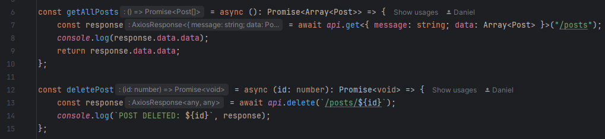
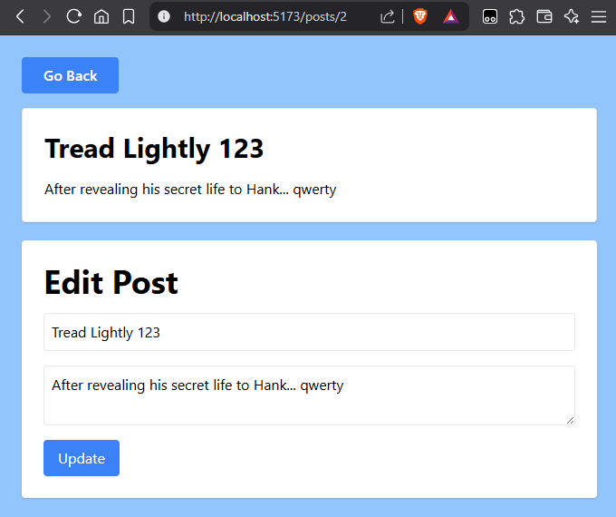
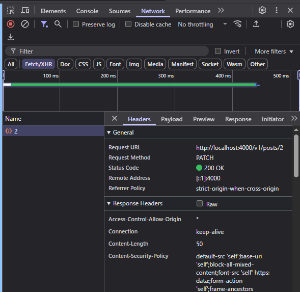
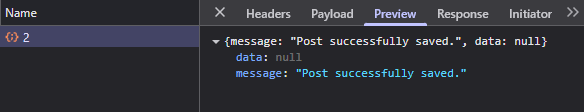
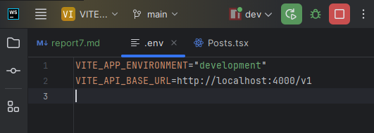
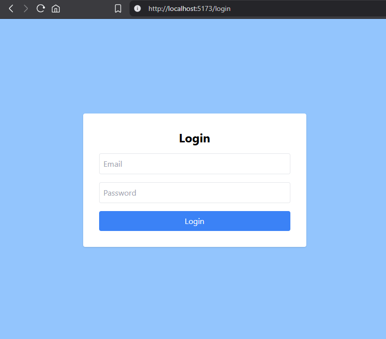
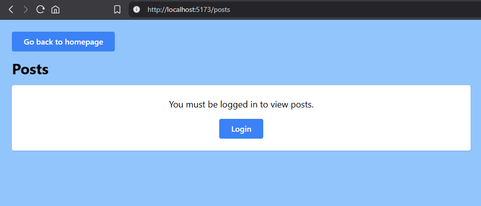
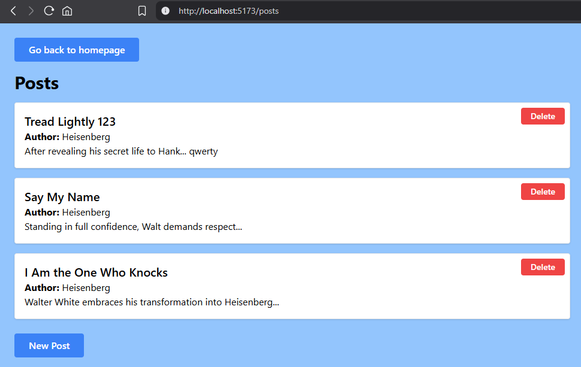
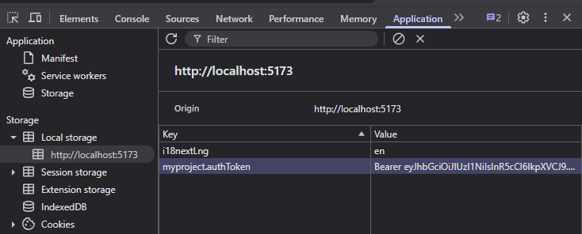

# Практична Робота №7

Configuration of `axios.ts`:
```typescript
import axios from 'axios';

// Створення окремого інстансу Axios
const api = axios.create({
	baseURL: import.meta.env["VITE_API_BASE_URL"],
	headers: {
		"Content-Type": "application/json",
	},
});

// Якщо токен доступний у змінній середовища -- додаємо в Authorization
const token = localStorage.getItem("myproject.authToken");
if (token) {
    api.defaults.headers.common['Authorization'] = `Bearer ${token}`;
}

// Інтерцептор для відповіді (обробка помилок)
api.interceptors.response.use(
    (response) => response,
    (error) => {
        // Тут можна додати глобальну обробку помилок, наприклад:
        console.error('API error:', error.response?.data || error.message);

        // Можна також виводити повідомлення користувачу через toast
        // toast.error(error.response?.data?.message || 'Unknown error');

        return Promise.reject(error);
    }
);

export default api;
```

### Two example usages of the api:



### Using the UI to Update a post:

(I added 123 to the title, and qwerty to the content)



### Results in Network tab after pressing the Update button:





### Contents of my .env file:



# Extra Task

### Login page code:

```typescript jsx
import { useState } from "react";
import { useNavigate } from "@tanstack/react-router";
import api from "../api/axios";

export const Login = () => {
    const [email, setEmail] = useState("");
    const [password, setPassword] = useState("");
    const [error, setError] = useState("");
    const navigate = useNavigate();

    const handleSubmit = async (e: React.FormEvent) => {
        e.preventDefault();
        setError("");

        try {
            const response = await api.post("/auth/login", { email, password });
            const token = response.data.data;

            // Зберігаємо токен (можна змінити на sessionStorage)
            localStorage.setItem("myproject.authToken", token);

            // Налаштування axios (автоматично підставляти токен)
            api.defaults.headers.common["Authorization"] = token;

            // Редирект на /posts
            navigate({ to: "/posts" });
        } catch (err) {
            console.error(err);
            setError("Invalid credentials");
        }
    };

    return (
        <div className="bg-blue-300 w-screen h-screen flex items-center justify-center">
            <form
                onSubmit={handleSubmit}
                className="bg-white p-8 rounded shadow w-full max-w-md space-y-4"
            >
                <h1 className="text-2xl font-bold text-center">Login</h1>

                {error && <p className="text-red-500 text-center">{error}</p>}

                <input
                    type="email"
                    placeholder="Email"
                    value={email}
                    onChange={(e) => setEmail(e.target.value)}
                    className="block w-full p-2 border rounded"
                    required
                />
                <input
                    type="password"
                    placeholder="Password"
                    value={password}
                    onChange={(e) => setPassword(e.target.value)}
                    className="block w-full p-2 border rounded"
                    required
                />
                <button
                    type="submit"
                    className="w-full bg-blue-500 text-white py-2 rounded hover:bg-blue-600 transition"
                >
                    Login
                </button>
            </form>
        </div>
    );
};
```

### Login page UI:



### Posts page before logging in:



### Posts page after logging in:



### Token is stored in the localStorage:


