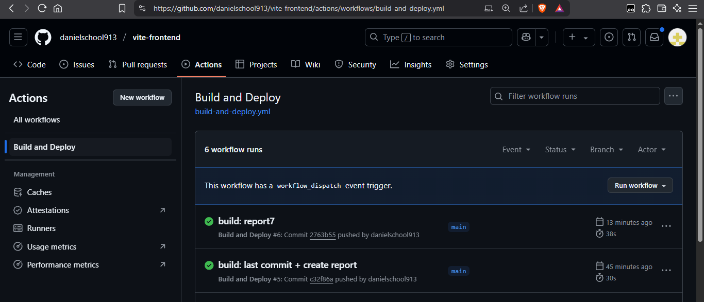
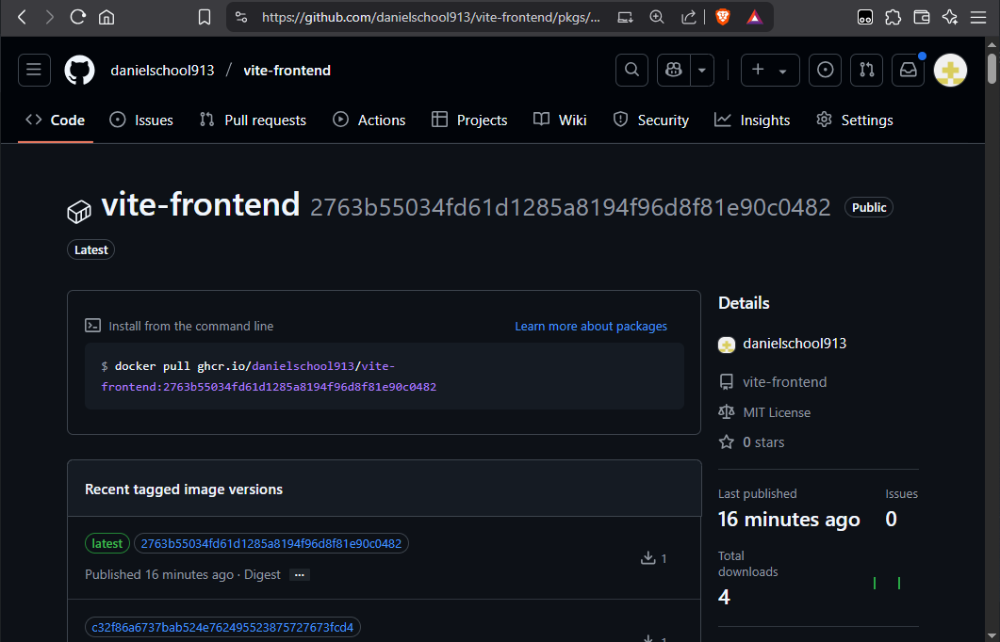

# Практична Робота № 8

### Created `.github/workflows/build-and-deploy.yml`

```yaml
name: Build and Deploy

on:
  # manual trigger
  workflow_dispatch:
  # trigger on push to main or feature/* branches
  push:
    branches:
      - main
      - feature/*
permissions:
  packages: write
  contents: read
jobs:
  build-and-push:
    runs-on: ubuntu-latest
    steps:
      # step 1: checkout repository
      - name: Checkout code
        uses: actions/checkout@v4

      # step 2: setup node.js
      - name: Setup Node.js
        uses: actions/setup-node@v4
        with:
          node-version: 20

      # step 3: install pnpm and dependencies, then build
      - name: Install and build
        run: |
          npm install -g pnpm
          pnpm install
          pnpm run build

      # step 4: login to ghcr
      - name: Login to GHCR
        uses: docker/login-action@v3
        with:
          registry: ghcr.io
          username: ${{ github.actor }}
          password: ${{ secrets.GITHUB_TOKEN }}

      # step 5: build and push docker image
      - name: Build and push
        uses: docker/build-push-action@v5
        with:
          context: .
          push: true
          tags: |
            ghcr.io/${{ github.repository_owner }}/${{ github.event.repository.name }}:latest
            ghcr.io/${{ github.repository_owner }}/${{ github.event.repository.name }}:${{ github.sha }}
```

### The workflow in the github repo Actions tab:

Note: Manual trigger also works.



### Final result: an auto built/deployed working Docker image hosted on GHCR.



